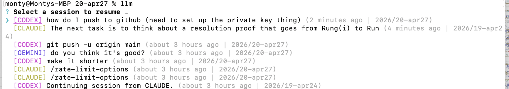
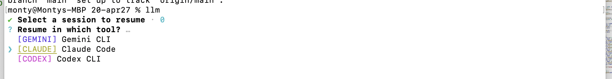

# LLM Session Resumer

An OSX command-line utility to aggregate and resume chat sessions from **Gemini CLI**, **Claude Code**, and **Codex CLI**. It supports native resumption and cross-tool migration (e.g., resuming a Claude session inside Gemini).

## 🚀 Quick Install (Add to PATH)

To install the tool as the `llm` command so you can run it from anywhere:

```bash
# 1. Ensure dependencies are installed in the tool directory
npm install

# 2. Create a symbolic link in your local bin
mkdir -p ~/.local/bin
ln -sf "$(pwd)/resume.js" ~/.local/bin/llm
chmod +x ~/.local/bin/llm
```

Now you can just type `llm` in any terminal.

---

## Features

- **Unified History:** See your last 15 sessions from all three tools in one list.
- **Smart Sorting:** Ordered by freshness so your most recent work is always at the bottom (selected by default).
- **Cross-Tool Migration:** Select a session from one tool and "resume" it in another. The tool automatically extracts the transcript and provides it as context to the new session.
- **Project Aware:** Automatically detects and switches to the correct working directory for each session.

## Usage

Simply run:
```bash
llm
```

1. Use the **Up/Down** arrows to select a session.
2. Press **Enter**.
3. Select the tool you want to resume in (defaults to the original tool).
4. Press **Enter** again to launch.

## Dependencies

- **Node.js**
- **npm** (for `enquirer` and `date-fns`)
- **Gemini CLI**, **Claude Code**, and/or **Codex CLI** installed on your system.
